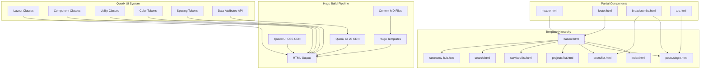
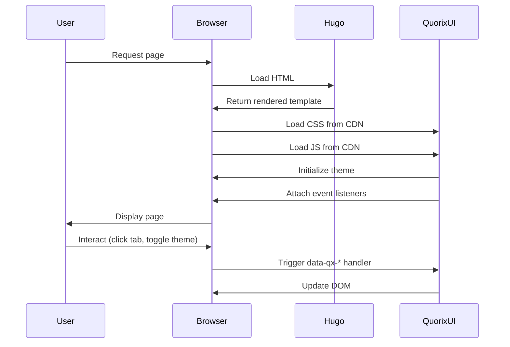

# Design Document: Quorix UI Restructure

## Overview

### Purpose

This design document outlines the complete restructuring of the `quorix-vietnam` Hugo static site to achieve 100% compliance with Quorix UI 2.1.4 design system. The project eliminates all custom CSS files and replaces them with official Quorix UI classes and declarative JavaScript APIs, ensuring consistency, maintainability, and WCAG 2.1 AA accessibility compliance.

### Scope

The restructure encompasses:
- Removal of all custom CSS files from `assets/css/extended/`
- Migration of 8+ layout templates to Quorix UI components
- Implementation of declarative JS APIs for interactive features (tabs, modals, theme toggle)
- Responsive design compliance across all breakpoints (320px to 1440px+)
- Light/dark theme system integration
- Accessibility improvements to meet WCAG 2.1 AA standards

### Goals

1. **Design System Compliance**: Use only approved Quorix UI classes documented in `.agent-instructions.md`
2. **Zero Custom CSS**: Remove all custom stylesheets and inline styles
3. **Accessibility**: Achieve WCAG 2.1 AA compliance with proper focus management, ARIA attributes, and keyboard navigation
4. **Performance**: Improve load times by eliminating unused CSS and leveraging CDN-hosted Quorix UI
5. **Maintainability**: Establish clear patterns for future development using only Quorix UI primitives

### Constraints

- MUST NOT use Tailwind, Bootstrap, or any CSS framework other than Quorix UI
- MUST NOT create new CSS files, `<style>` tags, or inline styles
- MUST NOT use Quorix UI classes not documented in the official CSS files
- MUST use only approved spacing scale (1, 2, 3, 4, 6, 8, 12)
- MUST use only approved grid classes (qx-grid-2, qx-grid-3)
- MUST use data attributes API (data-qx-*) for interactive features
- MUST maintain Hugo template compatibility (v0.146.0+)

## Architecture

### System Architecture



### Component Architecture

The design follows a layered component approach:

1. **Base Layer** (`baseof.html`): Provides HTML structure, theme initialization, and Quorix UI CSS/JS loading
2. **Layout Layer**: Page-specific templates (homepage, posts, projects, services)
3. **Partial Layer**: Reusable components (header, footer, breadcrumbs, TOC)
4. **Content Layer**: Markdown content rendered through Hugo's content pipeline

### Data Flow



## Components and Interfaces

### Core Layout Components

#### 1. Container System

**Purpose**: Provide consistent max-width constraints and horizontal padding

**Classes**:
- `qx-container`: Standard container (max-width: 1200px)
- `qx-container-lg`: Large container (max-width: 1400px)
- `qx-container-prose`: Prose container for article content (max-width: 65ch)

**Usage Pattern**:
```html
<div class="qx-container">
  <!-- Content with standard max-width -->
</div>
```

#### 2. Grid System

**Purpose**: Create responsive multi-column layouts

**Classes**:
- `qx-grid-2`: 2-column grid (responsive: 1 column on mobile)
- `qx-grid-3`: 3-column grid (responsive: 2 columns on tablet, 1 on mobile)

**Usage Pattern**:
```html
<div class="qx-grid-3 qx-gap-6">
  <article class="qx-card">...</article>
  <article class="qx-card">...</article>
  <article class="qx-card">...</article>
</div>
```

#### 3. Card Component

**Purpose**: Container for content blocks with consistent styling

**Classes**:
- `qx-card`: Base card with padding, border, and background
- Can be combined with interactive modifiers: `qx-hover-lift`

**Usage Pattern**:
```html
<article class="qx-card qx-hover-lift">
  <h3>Card Title</h3>
  <p>Card content...</p>
</article>
```

### Navigation Components

#### 4. Navbar

**Purpose**: Site-wide navigation with responsive behavior

**Classes**:
- `qx-navbar`: Base navbar container
- `qx-navbar-brand`: Logo/brand area
- `qx-navbar-nav`: Navigation links container
- `qx-navbar-link`: Individual nav link
- `qx-navbar-glass`: Optional glassmorphism effect

**Usage Pattern**:
```html
<nav class="qx-navbar">
  <div class="qx-navbar-brand">
    <a href="/">Logo</a>
  </div>
  <ul class="qx-navbar-nav">
    <li><a class="qx-navbar-link" href="/posts/">Posts</a></li>
    <li><a class="qx-navbar-link" href="/projects/">Projects</a></li>
  </ul>
</nav>
```

#### 5. Breadcrumbs

**Purpose**: Hierarchical navigation trail

**Classes**:
- `qx-breadcrumbs`: Container
- `qx-breadcrumb-item`: Individual breadcrumb

**Usage Pattern**:
```html
<nav class="qx-breadcrumbs" aria-label="Breadcrumb">
  <a class="qx-breadcrumb-item" href="/">Home</a>
  <span class="qx-breadcrumb-item">Posts</span>
</nav>
```

#### 6. Tabs

**Purpose**: Tabbed interface with declarative API

**Classes**:
- `qx-tabs`: Tab container
- `qx-tab`: Individual tab button
- `is-active`: Active tab state

**Data Attributes**:
- `data-qx-tab="pane-id"`: Links tab to pane
- `data-qx-tab-group="group-name"`: Groups tabs together
- `data-qx-pane-group="group-name"`: Groups panes together

**Usage Pattern**:
```html
<nav class="qx-tabs">
  <button class="qx-tab is-active" data-qx-tab="overview" data-qx-tab-group="main">Overview</button>
  <button class="qx-tab" data-qx-tab="details" data-qx-tab-group="main">Details</button>
</nav>

<section id="overview" data-qx-pane-group="main">Overview content</section>
<section id="details" data-qx-pane-group="main" class="qx-d-none">Details content</section>
```

### Interactive Components

#### 7. Modal/Dialog

**Purpose**: Modal overlays for focused interactions

**Classes**:
- `qx-dialog-backdrop`: Full-screen backdrop
- `qx-dialog-panel`: Modal content container
- `qx-dialog-header`: Modal header
- `qx-dialog-close`: Close button

**Data Attributes**:
- `data-qx-modal-target="modal-id"`: Opens modal
- `data-qx-dismiss`: Closes modal

**Usage Pattern**:
```html
<button class="qx-btn qx-btn-primary" data-qx-modal-target="confirm-modal">Open Modal</button>

<div id="confirm-modal" class="qx-dialog-backdrop qx-d-none" aria-labelledby="modal-title">
  <div class="qx-dialog-panel">
    <div class="qx-dialog-header">
      <h2 id="modal-title">Confirm Action</h2>
      <button class="qx-dialog-close" data-qx-dismiss aria-label="Close">×</button>
    </div>
    <p>Are you sure?</p>
    <div class="qx-d-flex qx-justify-end qx-gap-3 qx-mt-6">
      <button class="qx-btn qx-btn-ghost" data-qx-dismiss>Cancel</button>
      <button class="qx-btn qx-btn-primary" data-qx-dismiss>Confirm</button>
    </div>
  </div>
</div>
```

#### 8. Theme Toggle

**Purpose**: Switch between light and dark themes

**Data Attributes**:
- `data-qx-theme-toggle`: Toggles theme on click

**Theme State**:
- `data-theme="light"` on `<html>` element
- `data-theme="dark"` on `<html>` element
- Persisted in `localStorage["qx-theme"]`

**Usage Pattern**:
```html
<button class="qx-btn qx-btn-ghost" data-qx-theme-toggle aria-label="Toggle theme">
  <span>Toggle Theme</span>
</button>
```

### Content Components

#### 9. Badge

**Purpose**: Labels, tags, and status indicators

**Classes**:
- `qx-badge-soft-blue`: Soft blue badge
- `qx-badge-soft-yellow`: Soft yellow badge
- `qx-badge-soft-green`: Soft green badge
- `qx-badge-blue`: Solid blue badge
- `qx-badge-green`: Solid green badge
- `qx-badge-red`: Solid red badge
- `qx-badge-yellow`: Solid yellow badge

**Usage Pattern**:
```html
<span class="qx-badge-soft-blue">New</span>
<span class="qx-badge-green">Published</span>
```

#### 10. Button

**Purpose**: Interactive buttons with semantic variants

**Classes**:
- `qx-btn`: Base button
- `qx-btn-primary`: Primary action
- `qx-btn-outline`: Outlined button (secondary action)
- `qx-btn-ghost`: Ghost/text button
- `qx-btn-danger`: Destructive/dangerous action

**Usage Pattern**:
```html
<button class="qx-btn qx-btn-primary">Primary Action</button>
<button class="qx-btn qx-btn-outline">Secondary Action</button>
<button class="qx-btn qx-btn-ghost">Tertiary Action</button>
<button class="qx-btn qx-btn-danger">Delete</button>
```

#### 11. Callout

**Purpose**: Highlighted content blocks for warnings, info, success

**Classes**:
- `qx-callout-warning`: Warning callout
- `qx-callout-danger`: Danger/error callout
- `qx-callout-success`: Success callout

**Usage Pattern**:
```html
<div class="qx-callout-warning">
  <p>This is a warning message.</p>
</div>
```

### Form Components

#### 12. Form Inputs

**Purpose**: Text inputs, textareas, selects with consistent styling

**Classes**:
- Form classes from Quorix UI `forms.css`
- Inputs automatically styled when within form context

**Usage Pattern**:
```html
<form>
  <label for="search">Search</label>
  <input type="search" id="search" placeholder="Search posts...">
</form>
```

## Data Models

### Hugo Content Structure

#### Post Front Matter

```yaml
---
title: "Post Title"
date: 2024-01-15
description: "Post description"
tags: ["golang", "networking"]
categories: ["programming"]
series: ["Series Name"]
author: "Author Name"
cover:
  image: "/images/cover.jpg"
  alt: "Cover image description"
kicker: "FEATURED"
badges: ["New", "Updated"]
headlineBreaks: ["Line 1", "Line 2"]
headlineWidth: "30ch"
descriptionWidth: "50ch"
specialPost: false
tldr:
  - "Key point 1"
  - "Key point 2"
focusPoints:
  - title: "Focus 1"
    body: "Description"
seriesPreview:
  kicker: "Next in series"
  title: "Preview title"
  body: "Preview description"
  primaryUrl: "/next-post/"
  primaryLabel: "Read Next"
editorPick: true
popularity: 85
---
```

#### Project Front Matter

```yaml
---
title: "Project Name"
date: 2024-01-15
description: "Project description"
tags: ["golang", "api"]
categories: ["project"]
status: "active"
---
```

#### Service Front Matter

```yaml
---
title: "Service Name"
date: 2024-01-15
description: "Service description"
categories: ["service"]
---
```

### Theme State Model

```typescript
interface ThemeState {
  current: 'light' | 'dark' | 'auto';
  systemPreference: 'light' | 'dark';
  userPreference: 'light' | 'dark' | null;
}
```

Theme resolution:
1. Check `localStorage["qx-theme"]` for user preference
2. If no preference, use `prefers-color-scheme` media query
3. Set `data-theme` attribute on `<html>` element
4. Quorix UI CSS automatically applies theme-specific color tokens

### Bookmark/Save State Model

```typescript
interface BookmarkState {
  savedPosts: Set<string>; // Set of post URLs
  storageKey: 'qx:saved-posts:v1';
}
```

Persisted in `localStorage` as JSON array.

## Error Handling

### CSS Class Validation

**Problem**: Using non-existent Quorix UI classes causes silent failures

**Solution**:
- Maintain strict adherence to `.agent-instructions.md` class list
- Use browser DevTools to verify class application during development
- Document all classes used in each template

### Missing Data Attributes

**Problem**: Interactive features fail if data attributes are missing or misspelled

**Solution**:
- Validate data attribute presence in templates
- Ensure matching IDs between triggers and targets
- Test all interactive features manually

### Theme Flash on Load

**Problem**: Wrong theme briefly displays before correct theme loads

**Solution**:
- Inline theme initialization script in `<head>` before CSS loads
- Read `localStorage` and set `data-theme` synchronously
- Avoid FOUC (Flash of Unstyled Content)

```html
<script>
(function() {
  const stored = localStorage.getItem('qx-theme');
  const theme = stored || (window.matchMedia('(prefers-color-scheme: dark)').matches ? 'dark' : 'light');
  document.documentElement.setAttribute('data-theme', theme);
})();
</script>
```

### Accessibility Errors

**Problem**: Missing ARIA attributes or improper focus management

**Solution**:
- Use semantic HTML elements (nav, article, aside, section)
- Add ARIA labels to all interactive elements
- Implement focus trap in modals
- Return focus to trigger element when modal closes
- Test with keyboard navigation and screen readers

### Responsive Layout Breaks

**Problem**: Layouts break at certain viewport widths

**Solution**:
- Test at standard breakpoints: 320px, 640px, 768px, 1024px, 1440px
- Use Quorix UI responsive utilities (qx-d-none, qx-d-block at breakpoints)
- Ensure touch targets are minimum 44x44px on mobile
- Use `qx-flex-wrap` for wrapping flex items

### Hugo Build Errors

**Problem**: Template syntax errors or missing partials

**Solution**:
- Validate Hugo template syntax with `hugo server`
- Check for missing partial files
- Ensure all variables are properly scoped
- Use `with` and `default` for safe variable access

```go
{{- with .Params.cover.image -}}
  
{{- else -}}
  <span>No cover image</span>
{{- end -}}
```

## Testing Strategy

### Manual Testing Approach

Since this is a UI restructuring project without pure functions or business logic, Property-Based Testing is NOT applicable. Instead, we use:

#### 1. Visual Regression Testing

**Approach**: Compare screenshots before and after restructure

**Tools**: Manual comparison or tools like Percy, Chromatic

**Test Cases**:
- Homepage layout at 320px, 768px, 1440px
- Post single page with various content lengths
- Post list page with filters active
- Projects and services pages
- Navigation and footer across all pages
- Light and dark themes for all pages

#### 2. Accessibility Testing

**Approach**: Automated and manual accessibility audits

**Tools**:
- Lighthouse accessibility audit (target: 100 score)
- axe DevTools browser extension
- WAVE accessibility checker
- Manual keyboard navigation testing
- Screen reader testing (NVDA, JAWS, VoiceOver)

**Test Cases**:
- All interactive elements have visible focus indicators
- All images have alt text
- All form inputs have labels
- Modals have proper ARIA attributes
- Keyboard navigation works for all features
- Color contrast meets WCAG AA (4.5:1 for normal text, 3:1 for large text)
- Skip links are available
- Heading hierarchy is logical

#### 3. Responsive Design Testing

**Approach**: Test layouts at standard breakpoints

**Breakpoints**:
- 320px (small mobile)
- 640px (mobile)
- 768px (tablet)
- 1024px (desktop)
- 1440px (large desktop)

**Test Cases**:
- Grid layouts collapse appropriately
- Navigation is accessible on mobile
- Touch targets are minimum 44x44px
- Text remains readable (minimum 16px on mobile)
- Images are responsive
- No horizontal scrolling

#### 4. Interactive Feature Testing

**Approach**: Manual testing of all interactive features

**Test Cases**:
- Theme toggle switches between light and dark
- Theme preference persists across page loads
- Tabs switch content correctly
- Modals open and close
- Modal focus trap works
- Focus returns to trigger after modal closes
- Bookmark/save functionality persists
- Search suggestions appear and work
- Filter chips toggle active state
- Sort dropdown changes order

#### 5. Cross-Browser Testing

**Browsers**:
- Chrome (latest)
- Firefox (latest)
- Safari (latest)
- Edge (latest)
- Mobile Safari (iOS)
- Chrome Mobile (Android)

**Test Cases**:
- All layouts render correctly
- All interactive features work
- Theme switching works
- Data attributes API functions correctly

#### 6. Performance Testing

**Approach**: Lighthouse performance audits

**Metrics**:
- Performance score: >90
- First Contentful Paint: <1.5s
- Time to Interactive: <3s
- Cumulative Layout Shift: <0.1
- Largest Contentful Paint: <2.5s

**Test Cases**:
- Homepage load time
- Post single page load time
- Post list page load time
- CSS load time from CDN
- JS load time from CDN
- Image lazy loading works

#### 7. Hugo Build Testing

**Approach**: Verify Hugo builds successfully

**Test Cases**:
- `hugo server` runs without errors
- `hugo build` completes successfully
- All pages generate correctly
- No template errors in console
- RSS feed generates
- JSON search index generates

### Testing Checklist

Before considering the restructure complete:

- [ ] All custom CSS files removed from `assets/css/extended/`
- [ ] All layouts use only Quorix UI classes
- [ ] No inline styles or `<style>` tags
- [ ] Theme toggle works and persists
- [ ] All modals open/close correctly
- [ ] All tabs switch correctly
- [ ] Breadcrumbs display on all pages
- [ ] Navigation is accessible on mobile
- [ ] Footer displays correctly
- [ ] Search functionality works
- [ ] Filter chips work on post list
- [ ] Bookmark/save persists
- [ ] All pages pass Lighthouse accessibility audit (score >95)
- [ ] All pages pass Lighthouse performance audit (score >90)
- [ ] All pages tested at 320px, 768px, 1440px
- [ ] All pages tested in light and dark themes
- [ ] Keyboard navigation works for all interactive elements
- [ ] Focus indicators are visible
- [ ] Color contrast meets WCAG AA
- [ ] Hugo builds without errors

### Integration Testing

**Approach**: Test complete user flows

**User Flows**:
1. **Homepage → Post → Related Post**
   - Navigate from homepage to post
   - Click related post link
   - Verify breadcrumbs update
   - Verify theme persists

2. **Post List → Filter → Read Post**
   - Navigate to post list
   - Apply filter chip
   - Click filtered post
   - Verify post displays correctly

3. **Theme Toggle Flow**
   - Toggle theme on homepage
   - Navigate to post
   - Verify theme persists
   - Refresh page
   - Verify theme still persists

4. **Mobile Navigation Flow**
   - Open site on mobile (320px)
   - Open navigation
   - Navigate to page
   - Verify layout is mobile-friendly

5. **Search Flow**
   - Navigate to search page
   - Enter search query
   - View results
   - Click result
   - Verify post opens

### Snapshot Testing

**Approach**: Capture HTML snapshots of key pages

**Pages to Snapshot**:
- Homepage
- Post single (with TOC, without TOC)
- Post list (editorial, archive, mobile layouts)
- Projects list
- Services list
- Search page
- Taxonomy page

**Purpose**: Detect unintended changes in future updates

## Implementation Notes

### Migration Strategy

1. **Phase 1: CSS Cleanup**
   - Remove all files from `assets/css/extended/`
   - Verify Quorix UI CSS loads from CDN
   - Document all custom styles that need replacement

2. **Phase 2: Base Template**
   - Update `baseof.html` with Quorix UI structure
   - Implement theme initialization script
   - Update header and footer partials

3. **Phase 3: Homepage**
   - Restructure `layouts/index.html`
   - Replace custom classes with Quorix UI classes
   - Test responsive behavior

4. **Phase 4: Post Templates**
   - Restructure `layouts/posts/single.html`
   - Restructure `layouts/posts/list.html`
   - Implement tabs, modals, and interactive features

5. **Phase 5: Other Pages**
   - Restructure projects, services, search, taxonomy pages
   - Ensure consistency across all pages

6. **Phase 6: Testing & Refinement**
   - Run full testing checklist
   - Fix accessibility issues
   - Optimize performance
   - Document patterns

### Key Design Decisions

#### Decision 1: No Custom CSS

**Rationale**: Ensures long-term maintainability and consistency with Quorix UI updates

**Trade-off**: Some desired visual effects may not be achievable

**Mitigation**: Adjust design to use available Quorix UI classes

#### Decision 2: Declarative JS API Only

**Rationale**: Avoids custom JavaScript that could conflict with Quorix UI

**Trade-off**: Limited to features supported by data attributes API

**Mitigation**: Use data-qx-* attributes for all interactive features

#### Decision 3: CDN-Hosted Quorix UI

**Rationale**: Faster load times, automatic caching, no build step

**Trade-off**: Dependency on external CDN

**Mitigation**: Use reliable CDN (jsDelivr) with fallback option

#### Decision 4: Inline Theme Script

**Rationale**: Prevents theme flash on page load

**Trade-off**: Small inline script in HTML

**Mitigation**: Keep script minimal and synchronous

### Accessibility Considerations

- All interactive elements must have visible focus indicators (Quorix UI provides this by default)
- All images must have descriptive alt text
- All form inputs must have associated labels
- Modals must have `role="dialog"` and `aria-modal="true"`
- Modals must have `aria-labelledby` pointing to title
- Keyboard navigation must work for all interactive elements
- Focus must be trapped within open modals
- Focus must return to trigger element when modal closes
- All text must meet WCAG AA contrast requirements (4.5:1 for normal text, 3:1 for large text)
- Animations must respect `prefers-reduced-motion`
- Semantic HTML must be used for screen reader navigation
- Skip links must be available for keyboard users

### Performance Considerations

- Quorix UI CSS loaded from CDN with preconnect
- Images lazy loaded below the fold
- Critical CSS inlined (theme initialization)
- Minimal JavaScript (only Quorix UI declarative API)
- Hugo generates static HTML (no runtime rendering)
- RSS and JSON feeds generated at build time

### Browser Support

- Modern browsers (Chrome, Firefox, Safari, Edge) - latest 2 versions
- Mobile browsers (iOS Safari, Chrome Mobile) - latest 2 versions
- No IE11 support (Quorix UI uses modern CSS features)

### Future Enhancements

- Add more interactive features as Quorix UI adds data attributes API
- Implement progressive enhancement for advanced features
- Add more content types (case studies, tutorials)
- Implement full-text search with Algolia or similar
- Add analytics and performance monitoring

---

**Design Document Version**: 1.0  
**Last Updated**: 2024-01-15  
**Status**: Ready for Implementation
