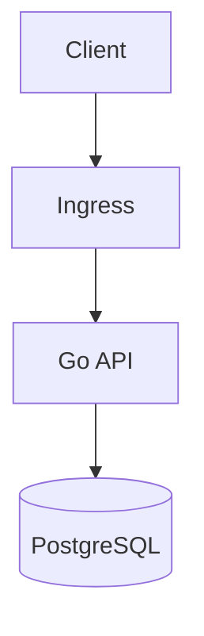

# Hugo Media Guide

## Mục tiêu

Thiết lập một quy chuẩn thống nhất để bài viết single trong `quorix-vietnam`:

- chèn ảnh cục bộ không phải lo path rời;
- chèn sơ đồ kiến trúc trực tiếp bằng Mermaid;
- vẫn tương thích với các bài cũ đang dùng ảnh global trong `static/images/`.

## Quy chuẩn chính

### 1. Ưu tiên leaf bundle cho bài có media

Thay vì:

```text
content/posts/ospf-lab.md
```

hãy dùng:

```text
content/posts/ospf-lab/
  index.md
  cover.png
  topology.png
  diagrams/
    adjacencies.png
```

Lợi ích:

- ảnh đi cùng bài viết, dễ quản lý và di chuyển;
- markdown chỉ cần gọi tên file tương đối;
- render hook của Hugo sẽ tự resolve page resource.

### 2. Cách chèn ảnh local trong markdown

Khi ảnh nằm trong cùng bundle:

```md

```

Khi ảnh nằm trong thư mục con:

```md

```

Quy ước:

- `alt` phải mô tả đúng nội dung ảnh.
- `title` được dùng làm caption hiển thị dưới ảnh.
- ưu tiên tên file ngắn, lowercase, có dấu `-`.

### 3. Khi nào dùng ảnh global

Chỉ dùng path global như `/images/...` cho:

- brand asset dùng chung toàn site;
- ảnh được nhiều bài tái sử dụng;
- asset không gắn với riêng một bài.

Ví dụ:

```md

```

### 4. Cover image cho bài viết

Trong front matter, `cover.image` giờ hỗ trợ cả:

- tên file local trong bundle, ví dụ `cover.png`;
- path global, ví dụ `images/brand/quorixbackground.png`.

Ví dụ bundle-local:

```toml
[cover]
  image = "cover.png"
  alt = "Sơ đồ tổng quan của bài viết"
  caption = "Kiến trúc tổng thể trước khi đi vào từng phần."
```

### 5. Chèn sơ đồ bằng Mermaid

Viết trực tiếp trong markdown:

````md

````

Quy ước:

- dùng Mermaid cho flow, sequence, topology, dependency graph;
- caption nên nói ngắn gọn sơ đồ đang diễn tả điều gì;
- nếu sơ đồ quá lớn hoặc cần asset minh họa thực tế, vẫn có thể dùng ảnh local.

## Tương thích ngược

- Bài cũ dùng `cover.image = "images/..."` vẫn chạy.
- Markdown image dùng URL tuyệt đối hoặc remote URL vẫn chạy.
- Quy chuẩn mới là hướng mặc định cho bài mới và bài có nhiều media.
